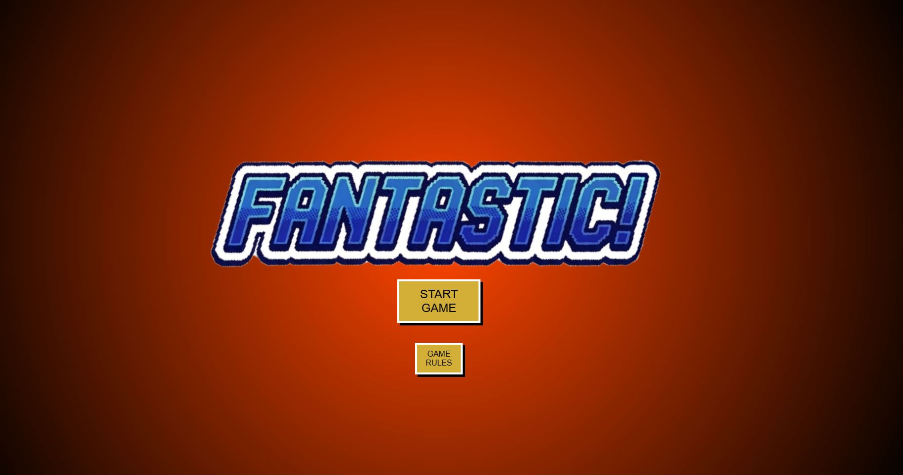
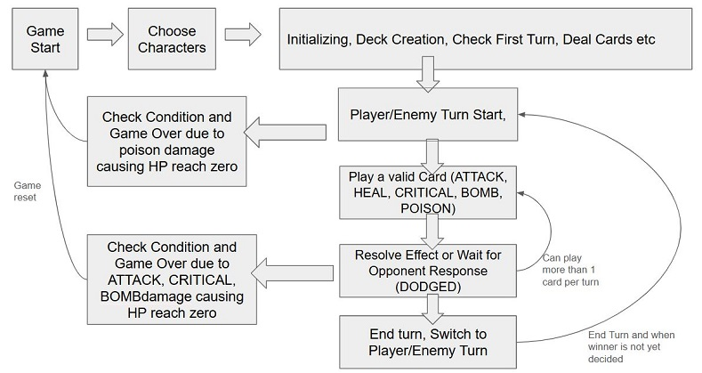
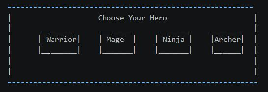
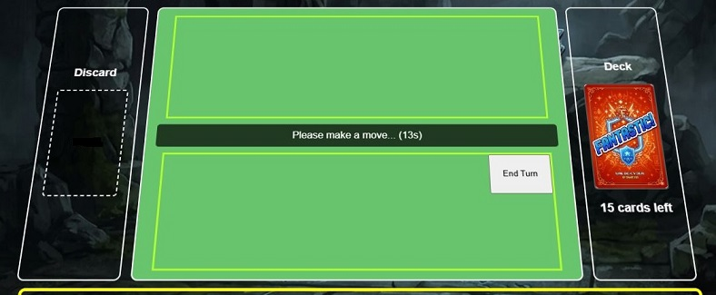

# PROJECT: FANTASTIC! Role-Playing Card Game

A fantasy-themed role-playing card game where players choose a hero class and battle against the Demon King using a deck of powerful cards. The game combines strategy, unique class abilities, and card mechanics to create an engaging gaming experience.

## Table of Contents

- [Features](#features)
- [Planning](#planning)
- [Wireframe](#wireframe)
- [Technologies Used](#technologies-used)
- [Getting Started](#getting-started)
- [Game Rules](#game-rules)
- [Screenshots](#screenshots)
- [Project Structure](#project-structure)
- [Challenges](#challenges)
- [Future Improvements](#future-improvements)
- [Attributions](#attributions)

## Features

- Play as a hero with different classes to choose from - Warrior, Mage, Ninja, Archer and battle against the Demon King and his minions.
- Using deck of cards containing ATTACK, DODGED, HEAL, CRITICAL, BOMB, POISON, form different strategies in conjuction with your class abilities to win the battle.
- You win by reducing the villians' health point to zero while preventing your own health points from running out.
- Game Draw when both player and enemy health points reach zero during the same turn or deck runs out.

## Planning

Initial planning and the key components of the game included:

- A gameboard consisting of a player and an enemy hand containers, status container and a active zone container
- Creation of the deck content and card mechanics
- Character designs with different stats (to adjust during game balance testing)
- Game Flow Management and turn-based mechanics implementation
- Resolution of card effects on the player and enemy characters
- Responses and delays to mimic real-time gameplay with human-like AI actions
- Enemy AI that makes decisions based on the card in hands
- Win/Lose conditions and game over check

During the development process, these are included:

- Cover page and Character selection page
- Improved error handling due to duplexing issues and undefined variables during the game flow
- Expanded card mechanics and improved enemy AI logic

_Below image is the game loop flowchart_



## Wireframe

_(From top to bottom) Gameboard consisting enemy zone, enemy status, active zone including deck and discard pile, player status and player zone._


Below is wireframe for character selection page, where players can choose from 4 different classes.



## Technologies Used

- HTML
- CSS
- JavaScript

- Images created using Gemini AI
- Debugging assisted by Copilot and Gemini AI

## Getting Started

Play online: [Fantastic! RPG Card Game](https://fantastic-rpg-card-game.netlify.app/)

To run locally:

1. Clone or download this project folder.
2. Open the `Backup` folder in VS Code.
3. Open `index.html` in your browser directly, or use a local server extension (for example, Live Server).
4. Start from the cover page, choose your class, then play cards from your hand during your turn.

## Game Rules

- Choose one hero class: Warrior, Mage, Ninja, or Archer.
- Both sides draw and play cards from a shared card system.
- Card types include ATTACK, DODGED, HEAL, CRITICAL, BOMB, and POISON.
- Reduce the enemy's HP to 0 before your own HP reaches 0.
- If both HP values reach 0 in the same turn, or if the deck is exhausted with no winner, the game ends in a draw.
- During reaction windows, you can counter incoming ATTACK cards with DODGED if available.

## Project Structure

- index.html: Main HTML page
- style.css: Styling
- script.js: App logic
- images/: Image assets

## Screenshots

_Below screenshots are taken from the game to showcase the character selection and card mechanics in action._


_Timed response with ATTACK and DODGED cards_


_Multiple response. During this timer, back end is waiting for player to either click a card, click end turn button, wait for timer to run out or game is over due to poison damage at the start of the turn._



## Challenges

Challenge 1: Implementing the timing mechanism for the player to respond to enemy attacks with DODGED cards was complex. It required managing asynchronous events and ensuring that the game flow paused correctly while waiting for player input.

- What I learned: I learned how to use Promises and async/await in JavaScript to handle asynchronous user interactions effectively. I also gained experience in managing game state and ensuring that the UI updates correctly based on player actions and timing. Although I could use simple method like setTimeout or if else logic, the use of Promises and async/await provided a cleaner solution for handling the timing and allows future scalability if I want to add more complex interactions due to newly created card mechanics.

Challenge 2: Unexpected bugs and errors due to duplexing issues and undefined variables during the game flow.

- What I learned: I learned the importance of thorough testing and debugging, especially in a complex game environment. AI suggested that I could implement token system to check the state of each function by comparing the token between the global and local scopes If the token is not valid, it will kill the repeated functions from proceeding, thus avoiding some of the duplexing issues.

## Code Snippets

```javascript
const resolveCardEffect = async (card) => {
  switch (card.type) {
    case "ATTACK":
      if (turn.includes("Player")) {
        updateDialogue(`Your hit is about to land...`);
        await pause(msgDelay);

        // Enemy DODGED card check
        const dodgedIndex = enemyHandCards.findIndex(
          (c) => c.type === "DODGED",
        );
        const cardData = enemyHandCards[dodgedIndex];
        if (dodgedIndex !== -1) {
          //Append card from enemy hand to active zone
          const dodgedCardElement = document.querySelector(
            `[data-id="${cardData.id}"]`,
          );
          dodgedCardOntoActiveZone(dodgedCardElement, turn);
          // Enemy avoids the damage
          const dodgedCard = enemyHandCards[dodgedIndex];
          updateDialogue(`Enemy played DODGED! Your attack was blocked.`);
          const movedCard = enemyHandCards.splice(dodgedIndex, 1)[0];
          enemyActiveZone.push(movedCard);
          await delay(msgDelay);
        } else {
          // No reaction, proceed with damage
          enemy.attack(player.ATK);
          loadEnemyData(enemy);
          updateDialogue(
            `No DODGED!! You attacked the enemy for ${player.ATK} damage!`,
          );
          await delay(msgDelay);
        }
      } else {
        // Enemy Attacking Player logic, add player reaction for DODGED card
        updateDialogue("Incoming Attack! Brace yourself...");

        // 1. Give the player 10 seconds to click their DODGED card
        const toPlayDodged = await waitForReaction(10000);

        if (toPlayDodged && toPlayDodged.status === "DODGED_PLAYED") {
          // Use the specific ID from the click to remove the correct card
          const index = playerHandCards.findIndex(
            (c) => c.id == toPlayDodged.cardId,
          );
          const cardData = playerHandCards[index];
          const cardElement = document.querySelector(
            `[data-id="${cardData.id}"]`,
          );
          dodgedCardOntoActiveZone(cardElement, turn);
          // Remove from player hand array
          if (index !== -1) {
            const movedCard = playerHandCards.splice(index, 1)[0];
            playerActiveZone.push(movedCard);
          }

          updateDialogue("You played DODGED! Damage avoided.");
        } else {
          player.attack(enemy.ATK);
          loadPlayerData(player);
          updateDialogue(`The enemy hit you for ${enemy.ATK} damage!`);
          await delay(msgDelay);
        }
      }
      break;
// more codes not shown below
};
```

Above code is a Switch case after player click a card to resolve the card effect of ATTACK, HEAL, CRITICAL, BOMB and POISON cards. The code above highlights one of the hardest card mechanics to implement - initiattion of ATTACK and countered by DODGED cards

Here are the list of functions written:

1. Setup and Core Data

- Character constructors: Character, Warrior, Minion, Mage, Ninja, Archer, DemonKing
- Character methods: attack, heal, critical, bomb, poison
- Purpose: define stats and combat behavior for all units

2. Game Reset

- resetPlayerHand
- resetEnemyHand
- resetActiveZones
- resetHTMLDOM
- resetToCoverPage
- Purpose: clean board state and navigate back to start safely

3. Deck and Card Management

- createDeck
- shuffleDeck
- renderHandCard
- renderEnemyHandCard
- playerDraw
- enemyDraw
- Purpose: build deck, randomize cards, render/draw cards for both sides

4. Character Display and Visual Updates

- loadPlayerData
- loadEnemyData
- turnIndicator
- updateDialogue
- syncPoisonFaceVisuals
- Purpose: Portraits, and status visuals in sync with game state

5. Timing and Input Helpers

- pause
- delay
- startVisualTimer
- waitForClick
- waitForReaction
- playerTurnCountDown
- Purpose: manage countdowns, async waits, and player reaction windows

6. Turn Order and Game Flow

- checkFirstTurnWithCardDealt
- gameFlowManager
- init
- playerTurn
- enemyTurn
- Purpose: initialize session, decide first turn, and run full turn loop logic

7. Card Effect Resolution

- resolveCardEffect
- cardOntoActiveZone
- dodgedCardOntoActiveZone
- Purpose: apply ATTACK/DODGED/HEAL/CRITICAL/BOMB/POISON logic and move cards to play zones

8. Game End and Restart Controls

- checkGameOver
- renderEndTurnButton
- renderResetButton
- Purpose: stop game correctly, show result, and provide restart/turn controls

## Future Improvements

- Improve enemy AI to consider more complex strategies and card combinations
- Add more card types and unique effects to increase strategic depth
- Add sound effects and background music for a more immersive experience

## Attributions

AI Tools: Gemini and Copilot

- Assisting in debugging and error handling due to duplexing issues and undefined variables.
- Generating images for the game assets and cover page.

MDN:

- https://developer.mozilla.org/en-US/docs/Web/JavaScript/Reference/Global_Objects/Promise/race
- https://developer.mozilla.org/en-US/docs/Web/JavaScript/Reference/Statements/async_function

Last but not least I would like to thank my peers and instructor (SEB SGP classroom 62) for their support and feedback throughout the development process. Your insights and encouragement were invaluable in helping me overcome challenges and improve the game.
